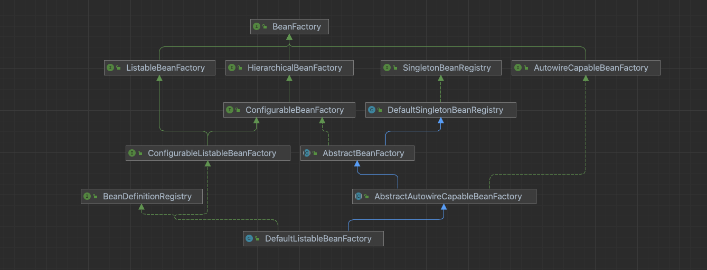

## BeanFactory

> 我们知道Spring最底层最核心的东西就是Bean工厂--BeanFactory了。这块简单介绍下Spring中的BeanFactory及其子类。

### 类图

先看下BeanFactory顶级接口及其子接口和实现类的类图：

### 类介绍

#### BeanFactory

> Spring Bean工厂的根接口，其他衍生的Bean工厂都是基于此接口并用于特定目的。

该接口主要提供获取Bean的一些方法

#### ListableBeanFactory

BeanFactory接口的扩展，可以枚举其所有Bean实例的Bean工厂实现，而不是像BeanFactory那样逐个尝试按照名称查找Bean。

#### HierarchicalBeanFactory

支持Bean工厂层次性结构，也就是Spring应用中包含父子容器。使用Spring、Spring MVC实现的Web项目，Spring就是父容器，管理Service、Repository相关Bean；Spring MVC就是子容器，管理Controllers、ViewResolver、HandlerMapping等相关内容。

#### ConfigurableBeanFactory

大多数Bean工厂要实现的接口，除了BeanFactory接口中的客户端方法，还提供了配置配工厂的工具，但是这并不意味着在正常的应用程序代码中使用，如果要使用Bean工厂，需要坚持使用BeanFactory或者ListableBeanFactory来满足典型的需求，这个扩展接口只是为了允许框架内部的即插即用和对Bean工厂配置方法的特殊访问